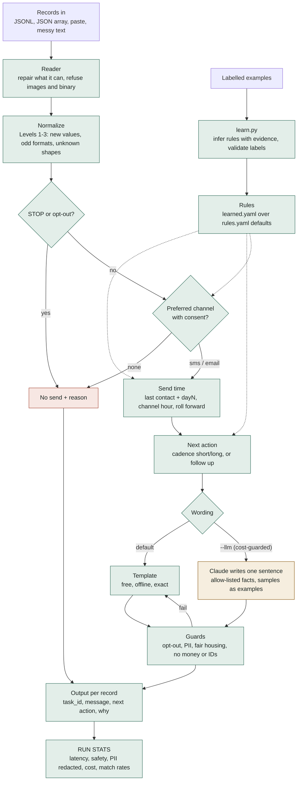

# Cheat Sheet: Plain-English Answers to Tough AI Questions

> For Mark, during the interview. Each answer is short enough to say out loud; **To prove, run:** gives the command that proves it. Don't claim more than what's here.

## The one-sentence pitch

"It's a decision bot for leasing outreach. It **learns its rules from labelled examples**, applies them with **deterministic code** for anything legal or compliance-related, and can optionally use **Claude to write the wording**. Every decision explains itself, and nothing personal leaks."

---

## The design in one picture



If the diagram doesn't render in your viewer, open the image: [`docs/design.png`](../docs/design.png).

**How to read it:** green boxes are **code**: every decision, every check, and the learning. The one amber box is **AI**, and it only writes a sentence. The red box is a **no-send**, which always carries a reason. The dotted lines show learned rules feeding the decisions.

**Say:** "Everything that can get you sued is green. The AI is one amber box that writes a sentence, and even its output goes through the guards, falling back to the template."

---

## If they ask "how is it designed?": about 3 minutes

**Order: the picture, then why, then where.** Then invite questions.

**1. The picture (the flowchart above).** Say: "Records come in, get read and normalized, and then code makes every decision: consent, channel, timing, next action. Only the wording can come from AI, and even that goes through the guards. Learned rules feed the decisions from the side."

**2. Five design decisions, each with its reason**

| Decision | Why |
|---|---|
| **Code decides, AI only writes words** | Consent, timing and fair housing must be guaranteed and explainable, not just probably right |
| **Rules learned from labelled examples, offline and versioned** | Learning you can see and measure; at runtime the bot just applies a reviewed file |
| **Stateless batch: one record in, one decision out** | It's simple, parallelizes, and needs no database for the task (the platform is designed, not built) |
| **Fail safe: never crash, never guess** | A bad or unclear record becomes a no-send with a reason |
| **Everything explains itself** | A "why" list on every decision; RUN STATS checks their own thresholds |

**3. Where it lives: every box in the diagram is a file**

```
bot.py                  the command you run (batch in, results out, RUN STATS)
learn.py                learns rules from labelled examples (offline)
outreach/
  reader.py             "Reader"        tolerate messy input, refuse images
  normalize.py          "Normalize"     Levels 1-3 for unfamiliar records
  decide.py             STOP, channel, send time, next action   (all code)
  compose.py            "Template"      the wording
  llm.py                "Claude"        optional wording, cost-guarded
  guards.py             "Guards"        opt-out, PII, fair housing, brand
  pipeline.py           wires the steps together, one record at a time
  learn.py / pii.py     rule learning / personal-data audit
config/
  rules.yaml            hand-written defaults
  learned.yaml          rules learned from the samples (the "model")
  properties.yaml       property facts and brand profile
tests/ + scripts/       tests, edge cases, decision table, checks, reports
plans/                  spec, design, decisions, reviews, documentation
```

**Close with:** "Every box in the diagram is a file you can open, and every decision is in `plans/decisions.md` with its reason."
To prove, run: `ls outreach config` (then open any file they point at)

---

## "What kind of AI is this?"

**Q: Is this an AI agent?**
A: "It's an autonomous decision pipeline: it runs with no human in the loop. I deliberately didn't let an AI choose its own steps, because consent and fair-housing rules must be guaranteed, not just likely. The AI is boxed in: it may choose words, never permissions."

**Q: Where's the machine learning?**
A: "The rules are learned from labelled examples. `learn.py` infers each rule (send hour, day offset, horizon threshold, next action) and shows how many examples support it. It's simple, explainable learning, which is the right tool when you have two examples."
To prove, run: `uv run learn.py plans/sample.jsonl`

**Q: Why not train a real model (a neural net, a decision tree)?**
A: "With two examples any model would just memorize them. Explainable rule learning with visible evidence is honest at this data size. With thousands of labelled records I'd try a small model, like a decision tree, and compare it on a hold-out."

**Q: Why not fine-tune an LLM?**
A: "Fine-tuning needs hundreds or thousands of examples and costs money. With two examples, in-context examples (few-shot) do the same job for the wording, for free, and can be changed instantly."

**Q: Why not RAG or embeddings?**
A: "There's nothing to retrieve. The property facts fit in a small config file. I'd add retrieval if there were a large knowledge base, like hundreds of property FAQs."

---

## "Does it really learn?"

**Q: How do you know it's learning and not just memorizing?**
A: "Leave-one-out testing: hide one example, learn from the rest, predict the hidden one. With two samples it scores 0/2, which proves the rules really come from the data. Add two more examples and it predicts both samples correctly."
To prove, run: `uv run learn.py plans/sample.jsonl tests/labelled_extra.jsonl --eval`

**Q: What's a hold-out set, and did you train on it?**
A: "Test data kept hidden until the end, to check the system generalizes. No, I won't learn from your 12. That would be training on the test set, which makes the score meaningless."
To prove, run: `cp plans/sample.jsonl /tmp/holdout.jsonl && uv run learn.py /tmp/holdout.jsonl` (it refuses any file with "hold" in its name)

**Q: What's overfitting here?**
A: "Rules that fit two examples perfectly but break on new ones. That's why every learned rule shows how many examples back it, the defaults are configurable, and I tested 16 made-up edge cases, plus a blind run on records it had never seen."

**Q: What's few-shot or in-context learning?**
A: "You show the model a few worked examples in the prompt and it copies the pattern, with no retraining. In `--llm` mode the two samples are the examples for writing style."

---

## "What about the LLM?"

**Q: Which model, and why?**
A: "Claude Haiku 4.5: fast and cheap, and good enough for short marketing sentences. Sonnet is a flag away (`--model claude-sonnet-5`), for richer wording at about twice the cost."

**Q: What about hallucinations?**
A: "The model only writes the friendly sentence, from facts I give it. It never writes the opt-out line, the link, the reply options or any decision. Its text is checked: no links, no numbers, no money, no protected-class words. If anything fails, the template is used instead. When I tightened this, I caught it inventing 'rent for January is due' and fixed the prompt."

**Q: Prompt injection?**
A: "Record fields are treated as data, never instructions. Only allow-listed fields reach the prompt, suspicious names become 'there', and the output is checked. A test plants 'ignore previous instructions' in the name field and it's never followed or repeated."
To prove, run: `uv run bot.py -i tests/edge_cases.jsonl --only injection`

**Q: How would you see what changed between two versions of the rules?**
A: "Pretty-print both runs and diff them. Each field sits on its own line, so the diff shows exactly which decision changed and why."
To prove, run: `BOT_RULES=hand uv run bot.py -i plans/sample.jsonl --pp --quiet -o out/hand.json; uv run bot.py -i plans/sample.jsonl --pp --quiet -o out/learned.json; diff out/hand.json out/learned.json`

**Q: Is the output deterministic?**
A: "Template mode is byte-identical every run. In `--llm` mode, answers are cached, so a re-run is identical too."

**Q: What does it cost?**
A: "Template mode: $0. LLM mode: about $0.002 per message on Haiku, so about $1 per 500 records. If a run would cost money, the bot stops and shows the amount unless you set a budget."
To prove, run: `uv run bot.py -i tests/edge_cases.jsonl --llm`

**Q: What if the AI provider is down?**
A: "Nothing changes in template mode: it never calls the API. In `--llm` mode each record falls back to the template, and the decisions are identical."

---

## "How do you measure it?"

**Q: How do you evaluate the output?**
A: "Controllable fields (channel, send time, call to action, next action) must match exactly. The wording is scored by similarity, because the spec says 'semantically matches'. Both samples: every field exact."
To prove, run: `uv run bot.py -i plans/sample.jsonl --compare`

**Q: What's p95 latency?**
A: "95% of records finish within this time. The target in the data is 2 seconds. Template mode: about a millisecond per record, and about 10 milliseconds for the very first one while it warms up. With the LLM: about 1.5 seconds per call."

**Q: What can't you measure?**
A: "The data sets `personalization_score_min` and `reply_classification_f1_min`, but the spec gives no scoring method and there are no replies to classify. The stats say 'not measured' rather than pretend."

---

## "Is it safe and fair?"

**Q: Fair housing?**
A: "Protected-class details (kids, religion, disability, national origin…) never reach the message or the model, and messages are scanned for those words. The '4 kids' test gets the same message as anyone else."
To prove, run: `uv run bot.py -i tests/edge_cases.jsonl --only kids`

**Q: PII?**
A: "Only the first name leaves the bot, because the expected output needs it. Twenty rental-PII categories are planted in tests: 81 items withheld, 0 leaked. No balances or account numbers ever go in a text or email."
To prove, run: `uv run bot.py -i tests/pii_cases.jsonl`

**Q: What does "brand_style_applied" mean, and do you check it?**
A: "The samples require it, but the assignment never defines it. To model the branding state, I derived a configuration file that applies branding rules: each property has a brand profile (the name it goes by, banned sales phrases, no emoji or shouting, length limits), and every message is checked against it. AI wording that breaks it falls back to the template. Every output reports the three required states from their data (consent verified, fair housing passed, brand applied), and the stats count them."
To prove, run: `sed -n '/^brand_default/,$p' config/rules.yaml` (the rules), then `uv run bot.py -i plans/sample.jsonl` (see "brand:" in each why, and "Req. states" in RUN STATS)

**Q: Bias in the model?**
A: "The model can't affect who gets contacted, when, or what's offered. Code decides that. It only phrases a sentence from allow-listed facts."

**Q: How do you know the channel logic is right in every case?**
A: "I don't sample it, I enumerate it. Every combination of the three consent flags and every ordering of preferred channels: 120 cases, each checked against the written policy. All 120 match, and it never sends without consent. The table also surfaced a policy question for an SME: 11 people consented to a channel that isn't in their preference list, so we don't send. Should consent alone be enough?"
To prove, run: `uv run python scripts/decision_table.py` (then open `plans/decision-table-channel.md`)

**Q: Data poisoning?**
A: "Learning is the one place where data changes behavior, so labels are validated. Bad names, out-of-hours send times and malformed examples are rejected and reported."

**Q: Explainability?**
A: "Every output has a 'why' list: the consent check, channel choice, the send-time arithmetic, the rule used, and a confidence level."

---

## "What about real-world data?"

**Q: What if our records look different?**
A: "Three levels. New values fall back to default rules. Odd formats are repaired and noted. Unknown record shapes are searched for the fields needed, and marked low confidence. If consent is missing, it never sends."
To prove, run: `uv run bot.py -i tests/edge_cases.jsonl --only MNT`

**Q: Messy input?**
A: "Chat-style pastes, smart quotes, trailing commas, Python-style records, other encodings: repaired, with each repair noted. An image is refused clearly."
To prove, run: `uv run bot.py -i tests/garbage_inputs.txt`

**Q: 100,000 records?**
A: "Template mode ran 100K in 52 seconds at $0. Records are independent, so it parallelizes. With the LLM it's about $170 on Haiku, or half that with the Batch API, and the bot shows that before spending."

---

## "What would you do next?"

- "More labelled examples: that's the biggest lever. Then retrain and track leave-one-out accuracy."
- "Monitor production: how often the AI's wording falls back to the template, low-confidence records, and consent-related no-sends."
- "Try a small learned model once there's enough data, and compare it to the rules on a hold-out."
- "Build the designed-but-not-built parts: reply handling, the support and owner views, sentiment."

---

## Words, in one line each

| Term | Plain meaning |
|---|---|
| LLM | The AI that reads and writes text (Claude) |
| Prompt | What we send the AI: instructions plus data |
| Few-shot | Examples in the prompt that the AI copies |
| Agent | An AI that chooses its own next steps (ours deliberately doesn't) |
| Pipeline | Fixed steps in a fixed order (what we built) |
| Guardrails | Code checks that block bad output |
| Hallucination | The AI making things up |
| Prompt injection | Text in the data trying to give the AI orders |
| Deterministic | Same input, same output, every time |
| Hold-out set | Test data kept hidden until the end |
| Leave-one-out | Test each example after learning from all the others |
| Overfitting | Memorizing the examples instead of learning the pattern |
| Fine-tuning | Retraining a model on your data (not used; too little data) |
| RAG | Looking things up in documents before answering (not needed here) |
| p95 | 95% of cases finish within this time |
| Tokens | Chunks of text the AI is billed by (~4 characters each) |
| Data poisoning | Bad training labels that corrupt what's learned |

## Don't claim

- That it's a neural network, a trained model, or fine-tuned.
- That it "understands" the renter.
- That two examples prove the rules are correct. They're the best inference, and they're configurable.
- That the scores for `personalization` or `reply F1` were measured.
- That real SMS or email are sent. They aren't; the bot outputs decisions.
